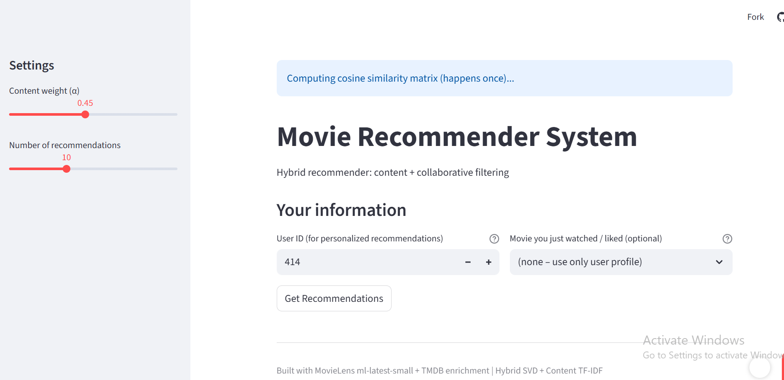
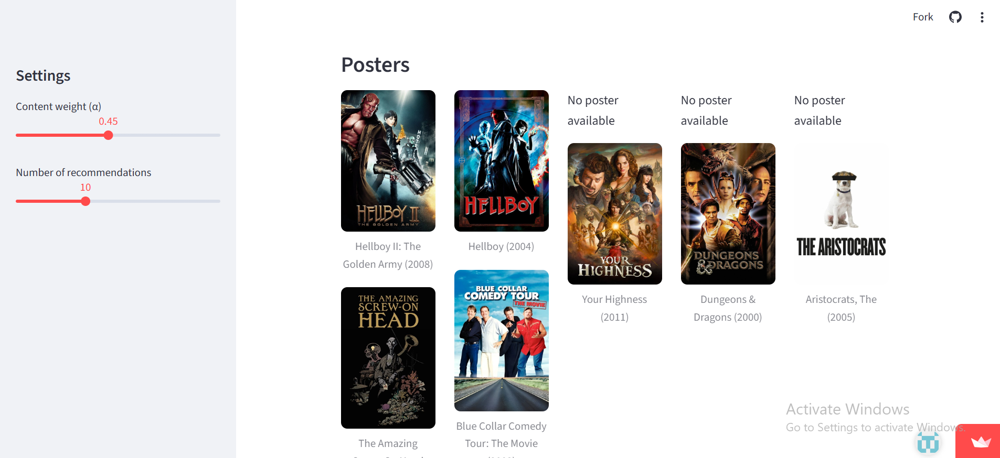
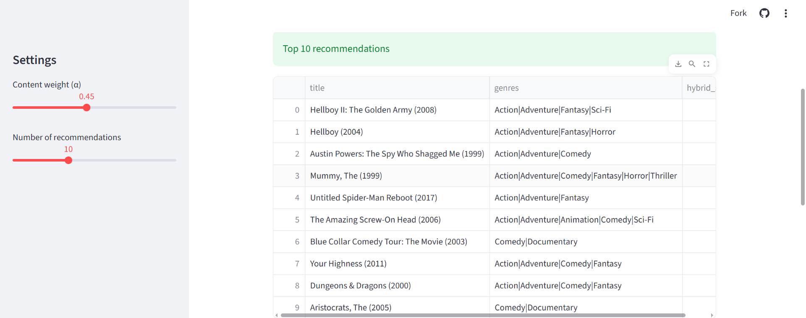

# Hybrid Movie Recommender System

An end-to-end movie recommendation project combining **content-based** and **collaborative filtering** techniques.  
Built using MovieLens ml-latest-small dataset + TMDB API enrichment for rich metadata (plots, keywords, cast, posters).

## Live Demo

Try the interactive web app here:  
[](https://hybrid-movie-recommender-marv.streamlit.app/)


## Features

- **Content-based filtering** — TF-IDF vectorization on genres, titles, tags, plots, keywords, directors & cast (TMDB enriched)
- **Collaborative filtering** — SVD matrix factorization (RMSE ~0.856 on test set)
- **Hybrid blending** — weighted combination of both methods with adjustable α
- **Cold-start handling** — pure content-based if anchor movie provided; popularity fallback otherwise
- **Fast & vectorized** — limited candidates + matrix operations for speed
- **Interactive UI** — Streamlit app with user ID input, anchor movie selection, sliders, and TMDB posters

## Screenshots

### Main Interface
  
User inputs: User ID + optional anchor movie + alpha slider

### Recommendations with Posters
  
Top 10 hybrid recommendations with TMDB posters

### Cold-Start Example
  
Pure content-based when using high user ID + anchor movie


## Tech Stack

- **Backend**: Python, pandas, NumPy, scikit-learn (TF-IDF & cosine similarity), Surprise (SVD)
- **Data**: MovieLens ml-latest-small + TMDB API (plots, keywords, cast, posters)
- **Frontend**: Streamlit (interactive web app)
- **Deployment**: Streamlit Community Cloud (free)

## Results & Performance

- **Collaborative (SVD)**: RMSE 0.8561 | MAE 0.6558 (excellent for dataset size)
- **Hybrid** → better relevance & personalization than single methods
- **Cold-start** → gracefully handles new users via content or popularity

## Local Setup

1. Clone the repo

   ```bash
   git clone https://github.com/marvelousorimoloye-hub/hybrid-movie-recommender.git
   cd hybrid-movie-recommender